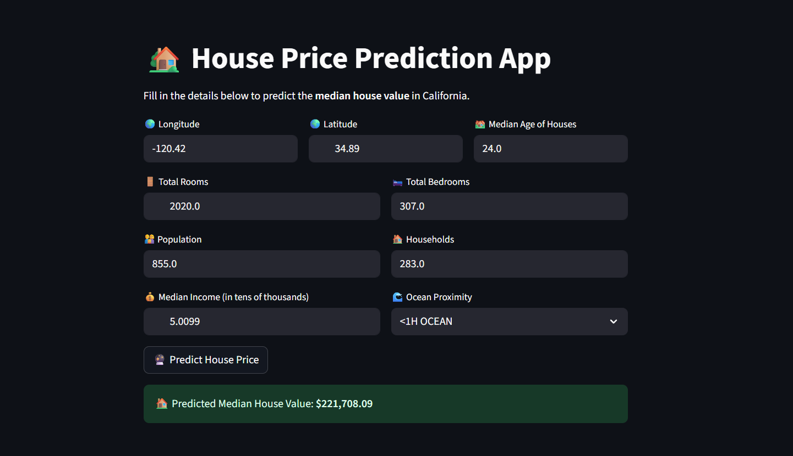

# 🏡 California House Price Prediction

A simple Machine Learning Web App built with **Streamlit** to predict California Housing Prices.  
The model is trained on the **California Housing Dataset** and predicts the median house value based on user inputs.

---

## 🚀 Live Demo

🔗 [Try the App Here](https://house-price-prediction-california.streamlit.app)  

---

## 📊 Features

- ✔️ Predict house price based on user inputs  
- ✔️ Simple typing input fields (no +/- buttons)  
- ✔️ Dropdown menu for ocean proximity selection  
- ✔️ Automatically downloads trained ML model from Google Drive  
- ✔️ Clean & responsive UI for smooth user experience  

---

## 🛠️ Tech Stack

- **Python 3.9+**  
- **Streamlit** – Web App Framework  
- **Scikit-Learn** – Machine Learning  
- **Pandas & NumPy** – Data Processing  
- **Joblib** – Model Serialization  
- **gdown** – Download model from Google Drive  

---

⚙️ How It Works

The app takes user inputs like:

Longitude, Latitude, Housing Median Age

Total Rooms, Total Bedrooms, Population, Households

Median Income, Ocean Proximity

The trained ML model (Linear Regression / Random Forest) is automatically downloaded from Google Drive when the app starts.
It then processes the inputs and predicts the median house value in California.

---
📸 Screenshots



---
📂 Project Structure

House-Price-Predictio/
│-- app.py               # Main Streamlit app (or streamlit_app.py)
│-- House_Price.py       # Script to train & save model
│-- pipeline.pkl         # Preprocessing pipeline
│-- requirements.txt     # Dependencies
│-- README.md            # Documentation
│-- preview.png          # App screenshot used in README

---

📋 Requirements
streamlit>=1.26.0
pandas>=2.1.0
numpy>=1.26.0
scikit-learn>=1.3.0
joblib>=1.3.0
gdown>=4.7.1

---

---

## 📦 Installation & Setup

1. **Clone the repository**
   ```bash
   git clone https://github.com/libta018/House-Price-Predictio.git
   cd House-Price-Predictio


2. Create a virtual environment
python -m venv venv
venv\Scripts\activate      # On Windows

3. Install dependencies
pip install -r requirements.txt

4. Run the app locally
Replace app.py with your filename if different (e.g. streamlit_app.py)
streamlit run app.py

---


## 👨‍💻 Author

**Mohammed Talib**  

📧 Email: [mohammedtalib306@gmail.com](mailto:mohammedtalib306@gmail.com)  
💼 LinkedIn: [Connect with me](https://www.linkedin.com/in/mohammedtalib)
🌐 Live Demo: [Click Here](https://house-price-prediction-california.streamlit.app)  


## ⭐ Acknowledgments

- Dataset: [California Housing Dataset (Scikit-learn)](https://scikit-learn.org/stable/datasets/real_world.html#california-housing-dataset)  
- Framework: [Streamlit](https://streamlit.io/)  


